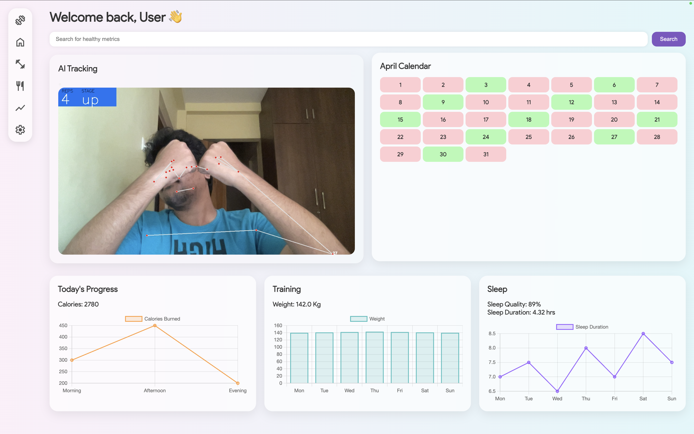

# 💪 Personal Gym Trainer

An AI-powered personal fitness dashboard built with Flask and MediaPipe that tracks your exercises using live camera feed, displays progress with beautiful charts, and provides a modern pastel-themed UI.

## 🚀 Features

- 🎥 Live AI camera pose detection using MediaPipe
- 🔄 Real-time rep counter
- 📈 Weekly progress, calorie intake, sleep, and training stats
- 🧠 Responsive, curvy UI with modern pastel theme
- 📊 Interactive charts using Chart.js
- 🧩 Modular Flask-based structure

## 🖼️ UI Preview



## 🛠️ Tech Stack

- **Backend:** Python Flask
- **Computer Vision:** OpenCV, MediaPipe
- **Frontend:** HTML, CSS (Product Sans + Google Icons), Chart.js
- **Design:** Curvy cards, responsive layout, pastel red/green/orange/purple theme

## 📦 Installation

### 1. Clone the repository

```bash
git clone https://github.com/thakursameershetty/personal-gym-trainer.git
cd personal-gym-trainer
```

### 2. Create a virtual environment (recommended)

```bash #for Mac
python -m venv venv
source venv/bin/activate  # For Mac
```

```bash #for Windows
python -m venv venv
venv\Scripts\activate #For Windows
```

### 3. Install dependencies

```bash
pip install -r requirements.txt
```

### 4. Run the app

```bash
python app.py
```

### 5. Open in Browser
Go to http://127.0.0.1:5000

🧠 Tips
	•	Ensure your webcam is connected and enabled in the browser.
	•	You can customize the workouts, progress values, and schedule easily via the HTML.
	•	Extend the pose detection logic in app.py to support other exercises.